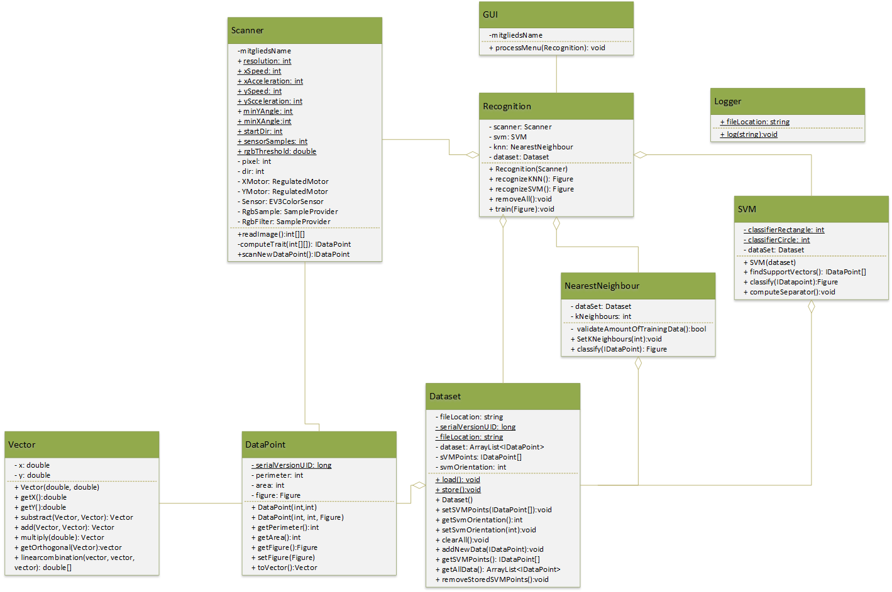

## Herzlich Willkommen zu EVE - Lego Image Recognition Project

Im folgenden werden wir das "EVE - Lego Image Recognition Project" vorstellen:

### Idee des Projekts
Die Idee des Projektes entstand während der Vorlesung Intelligente Agenten und Multiagentensysteme an der Dualen Hochschule Baden-Württemberg. 
Ziel war es, einen Roboter zur Erkennung von Bildern zu bauen und zu programmieren. Dabei ging es uns darum, mit einem lernenden Algorithmus (sog. Support Vector Machines) in der Lage zu sein, Kreise von Quadraten zu unterscheiden. Eingesetzt werden sollen zur Unterscheidung die beiden Parameter Flächeninhalt und Umfang der einzelnen Figuren. 
Eingesetzt wird bei diesem Projektder EV3-Brick von Lego Mindstorms. Dieser wurde mit der <a href="https://github.com/ChristopherTr/legoAgent/wiki/Installation-Toolchain">Anleitung auf den Wiki-Seiten dieses Projekts</a> mit dem Projekt LeJOS installiert und kann damit mit Java programmiert werden. 

### Aufbau
#### Hardware

Der Scanner ist so konstruiert, dass der obere Motor den Lego-Farbsensor auf einer Linie entlang hin und her bewegen kann und damit eine "Scanner-Linie" bildet. Während der obere Motor diese Linie entlang fährt, scannt der Farbsensor in gleichmäßigen Abständen den Bildpunkt, welcher sich zu diesem Zeitpunkt unterhalb des Farbsensors befindet. Nach jedem Abfahren der Linie wird das Bild von dem unteren Motor (unterhalb des Scanner-Bilds) eine Bildpunkt-Breite weiter geschoben. Nach jedem Schritt fährt der obere Motor einmal die Linie entlang. 

<video src="pictures/video1.mp4" width="320" height="200" controls preload></video>
<video src="pictures/video2.mp4" width="320" height="200" controls preload></video>

#### Software
Die Software des Roboters ist modular aufgebaut und besteht aus einigen Klassen für verschiedene Aufgaben. 

* Die GUI-Klasse des Programms stellt das Menü auf dem LCD-Display des Bricks dar und übernimmt die Interaktion mit dem Benutzer. 
* Durch die Recognition-Klasse wird für die GUI die Logik des Programms gekapselt. Damit kann vermieden werden, dass die GUI Hintergrundwissen über den Aufbau des Programms haben muss. 
* Die Scanner-Klasse steuert die Hardware und liest das Bild ein. Zusätzlich wird von dieser Klasse das Bild ausgewertet und die beiden relevanten Größen Umfang und Flächeninhalt berechnet. 
* In der DataPoint-Klasse wird ein einzelner gesammelter Datenpunkt (also die Auswertung eines Bildes) gespeichert. 
* Die SVM-Klasse übernimmt die Implementierung der Support Vector Machine und führt die erforderlichen Berechnungen zur Erstellung und dem Training der SVM. Auch enthalten ist die Auswertung weiterer Bilder, welche von der SVM klassifiziert werden soll. 
* Durch die Dataset-Klasse werden die verwendeten Daten verwaltet. Der Zustand der SVM wird mithilfe dieser Klasse persistent auf der SD-Karte abgelegt. 
* Vector ist eine Hilfsklasse, welche verwendet wird, um Berechnungen der SVM zu erleichtern. 
* Logger dient dem Debugging und der Protokollierung

Eine ausführliche Klassendokumentation ist <a href="https://christophertr.github.io/legoAgent/html/">hier</a> zu finden. 

#### Programmablauf
Bei der Verwendung des Scanners gibt es drei verschiedene Use-Cases: 
* Bisherige Daten löschen
* Anhand eines Bildes trainieren
* Ein Bild erkennen
Der interne Ablauf dieser Anwendungen ist in der folgenden Abbildung dargestellt. 

#### Funktionsweise der SVM
Die SVM arbeitet darüber, die erkannten Bilder anhand der beiden Parameter Umfang und Flächeninhalt zu klassifizieren. Dabei wird der Umfang quadriert, um die Formen besser voneinander unterscheiden zu können. Mit Testdaten ergeben sich folgende Bilder: 

damit können beide Gruppen sehr gut durch eine Gerade angenähert werden: 

Folgendes Schaubild verdeutlicht die Funktionsweise der SVM, welche vektorbasiert eine Trennung der beiden Gruppen errechnet.

Dabei wird eine Gerade zur Trennung der Punktewolken erstellt und durch Abstandsbestimmung eines Punktes zu dieser Geraden kann der zu analysierende Punkt bestimmt werden. Im Bild wird die Gerade zur Trennung durch die rote Markierung und den Vektor AB erstellt. 

### weitere Schritte
Aktuell ist das Projekt noch im Prototyp-Status. Es sollte im Folgenden ein Code-Review durchgeführt werden, um Bugs zu finden und Performance-Probleme zu identifizieren. 
Auch ist die Mechanik des Scanners nicht vollständig zuverlässig und verursacht teilweise geringe Abweichungen, die die Messergebnisse verfälschen. Diese Fehler sollten ausgebessert werden. 
